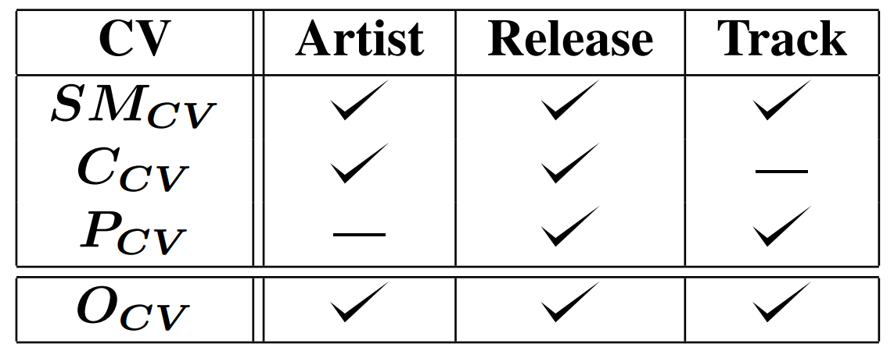
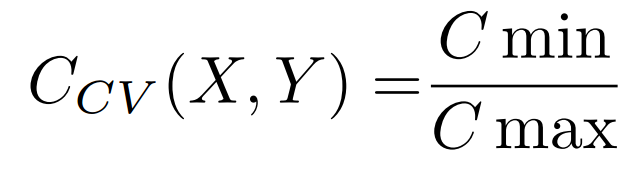
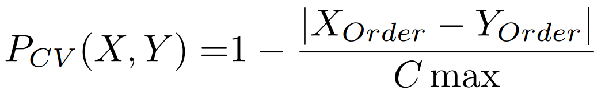
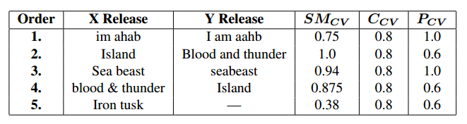

# Criteria Requirements

# String-matching
Levenshtein distance (LD) is calculated for tracks, releases, and artists. LD compares character similarity across two strings and provides a value ranging from 0 to 1. LD is a common procedure in string-matching processes, and has been used previously to link music metadata into MusicBrainz. Track, release, and artist LDs are calculated on an pairwise basis, and expressed as string-matching confidence values.

# Cardinality
Cardinality confidence values are calculated by dividing the minimum cardinality by the maximum. For example, Table \ref{tab:release} compares two releases, X and Y, with different cardinalities (5 versus 4). Column 5 is therefore: 4/5 = 0.8. This value is attributed to each track within both releases. In a similar manner, artist-level cardinality is calculated by comparing the number of distinct tracks attributed to each artist across resources. Cardinality criterion is not used with respect to track matching.

# Positioning
When position metadata is available, positioning confidence values are calculated for tracks and releases. Similar to cardinality, positioning is calculated for the track with the maximum LD comparison; the linked attribute from the API with the maximum position is used as the denominator against the attribute with the minimum position. In the table above, Track 2 in X is to Track 4 in Y, the strings exactly match. The positioning for Track 2 in X is therefore 0.6, calculated by dividing the minimum track position (2) by the maximum (4).

# Overall
Overall confidence values are calculated for artist, release and track by taking a weighted average from all available confidence value calculations. As shown in the table above Artist overll confidence values are calculated by taking the weighted average of string-matching and cardinality; track overall confidence values are calculated by taking the weighted average of string-matching and positioning. For a release overal confidence, a weighted average of all values is possible.

# Criteria Example

Example of release matching process using 2 APIs X and Y (e.g. Spotify and MusicBrainz). Release and artist names are first compared prior to assigning track consistency values. When releases agree on artist and release strings, track information regarding the releases is compared. In this example, the 3 columns on the left disagree in the following ways: X has a cardinality of 5, whereas Y's cardinality is 4; and track orders 2 and 4 within X are reversed within Y. The 3 columns on the right show CVs calculated per track for each criterion described above. 