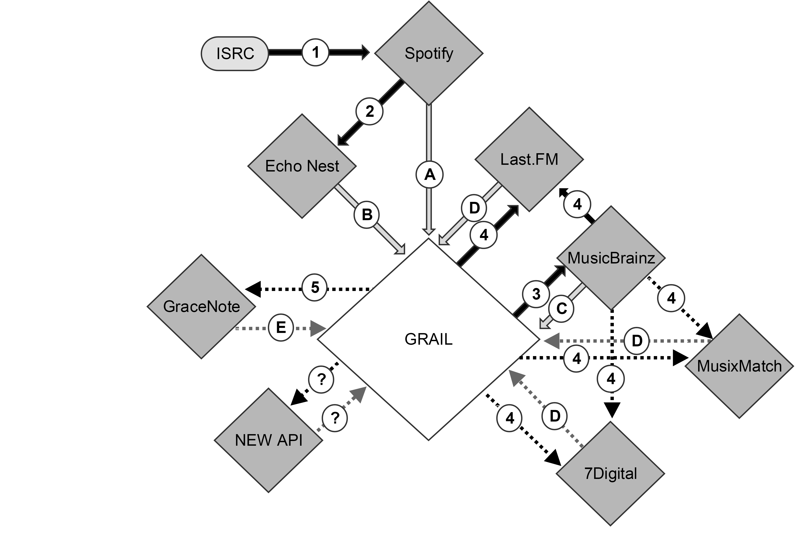

Figure illustrates how crawlers access targeted APIs (gray diamonds), what validation steps are used to access APIs (black lines), and what metadata is ingested into GRAIL (gray lines). Solid lines represent active GRAIL crawls, and dotted lines represent crawls currently in development.

# Validation Steps
* <b>Step 1.</b> ISRC seed-data from Nokia DB accesses metadata from the Spotify API. Artist, release, and track consistency calculations are conducted using string-matching, positioning, and cardinatlity.
* <b>Step 2.</b> Spotify tracks IDs were used to link to Rosetta Stone artist IDs. Due to Spotify's purchase of The Echo Nest in 2014 and subsequent discontinuation, consistency validation between this two services was not possible (or necessary).
* <b>Step 3.</b> Nokia Music artist, release, and track string names are used to query the MusicBrainz API.  Artist, release, and track consistency calculation using $string-matching, positioning, and cardinatlity
* <b>Step 4.</b> Nokia Music artist, release and track string names, and linked MusicBrainz IDs, from ingestion step C are being used to conduct artist, release, and track consistency calculations using string-matching, positioning, and cardinatlity.
* <b>Step 5.</b> In due course, Nokia Music artist, release, track string names will be used to access GraceNote's metadata via text search. As above, artist, release, and track consistency calculations are conducted using string-matching, positioning, and cardinatlity.

# Ingestion Steps
* <b>Step A.</b> Spotify artist, release, and track IDs are ingested into GRAIL. Crawlers check if an ID has changed since it last checked. New IDs, including CV values and timestamps, are inserted as additional rows. IDs which have not changed are updated with modified CV values and timestamps.
* <b>Step B.</b> The Echo Nest track and artist IDs were ingested into GRAIL, in addition to any artist IDs collected from the Rosetta Stone project.
* <b>Step C.</b> MusicBrainz artist, release, and track IDs are ingested into GRAIL based on API text searches.
* <b>Step D.</b> Artist, release, and track IDs CVs are calculated for Last.FM metadata, and are ingested to GRAIL using linked MusicBrainz IDs and text searches. MusixMatch and 7digital API crawlers are in development using a similar process.
* <b>Step E.</b> Artist, release, and track ID CVs will be ingested for new APIs, and any shared metadata that can improve accuracy.